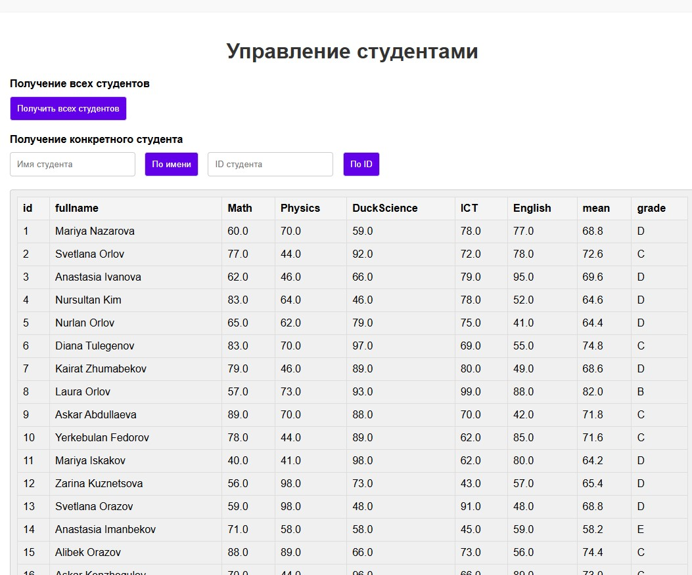
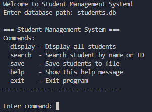

# Проект 
- *100% запускается на версии Python 3.12.8*
## Общая структура проекта

- `main.py` — оконный интерфейс.
- `prepare.py` — вспомогательный скрипт,который генерирует тестовые данные.
- `display_table.py` — консольный интерфейс.
- `modules/` — директория с модулями и вспомогательными файлами:
  - `backend.py` — взаимодействие с базой данных, получение и обработка данных о студентах.
  - `utils.py` — вспомогательные классы и функции для работы с базой данных и SQL-запросами.
- `README.md` — описание проекта и инструкции по запуску.
- `requirements.txt` — список зависимостей проекта.

## Структура базы данных
Состоит из одной таблицы:

### Таблица `students`

| Поле        | Тип        | Описание                        |
|-------------|------------|---------------------------------|
| id          | FLOAT    | Уникальный идентификатор студента (PRIMARY KEY) |
| fullname    | TEXT       | ФИО студента                    |
| Math        | FLOAT    | Оценка по математике            |
| Physics     | FLOAT    | Оценка по физике                |
| DuckScience | FLOAT    | Оценка по утковеденью           |
| ICT         | FLOAT    | Оценка по информатике           |
| English     | FLOAT    | Оценка по английскому языку     |
---
- Средний балл и итоговая оценка (Grade) вычисляются на лету при выборке данных.

## Описание модулей

- **modules/backend.py**: инкапсулирует работу с базой данных, предоставляет методы для получения всех студентов, поиска по имени или id, использует query_manager для выполнения SQL-запросов.
- **modules/utils.py**: содержит вспомогательные классы для управления SQL-запросами (автоматическая загрузка SQL-файлов и их выполнение), а также для работы с временными базами данных (например, для тестирования).

## Графический интерфейс

Позволяет визуально увидеть таблицу по одному из 3х фильтров

## Консольный интерфейс

## SQL запросы

- **all_students.sql** — выбирает всех студентов из таблицы, а также вычисляет средний балл (Average) и итоговую оценку (Grade) для каждого студента на основе их оценок по предметам.
- **get_columns.sql** — возвращает список всех столбцов таблицы `students`, используется для динамического формирования заголовков таблицы.
- **get_students_by_name_or_id.sql** — осуществляет поиск студентов по имени (частичное совпадение) или по id, возвращает те же поля, что и all_students.sql, включая средний балл и итоговую оценку.